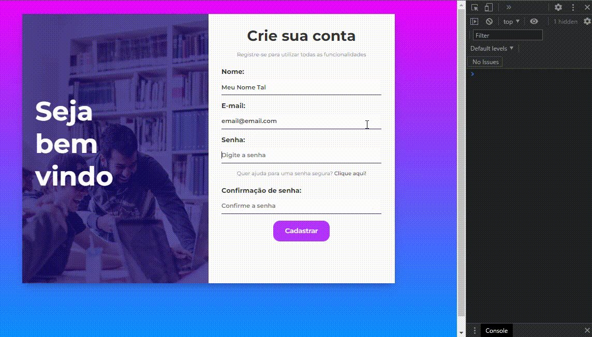

<h1 align="center"> Gerador senha</h1>

## Sobre:
Decorre de estudos do FrontEnd.  
Projeto que tem a finalidade de gerar senhas, caso o usuário deseja, ao realizar o cadastro no formulário.

## Ilustração:
 
 
   
 

## Tecnologias utilizadas:
- HTML | CSS | JavaScript

## Possíveis melhorias:
* Colocar um filtro na escolha de como poderá ser a senha aleatória.

[Para visualizar o projeto: Clique aqui!]()
